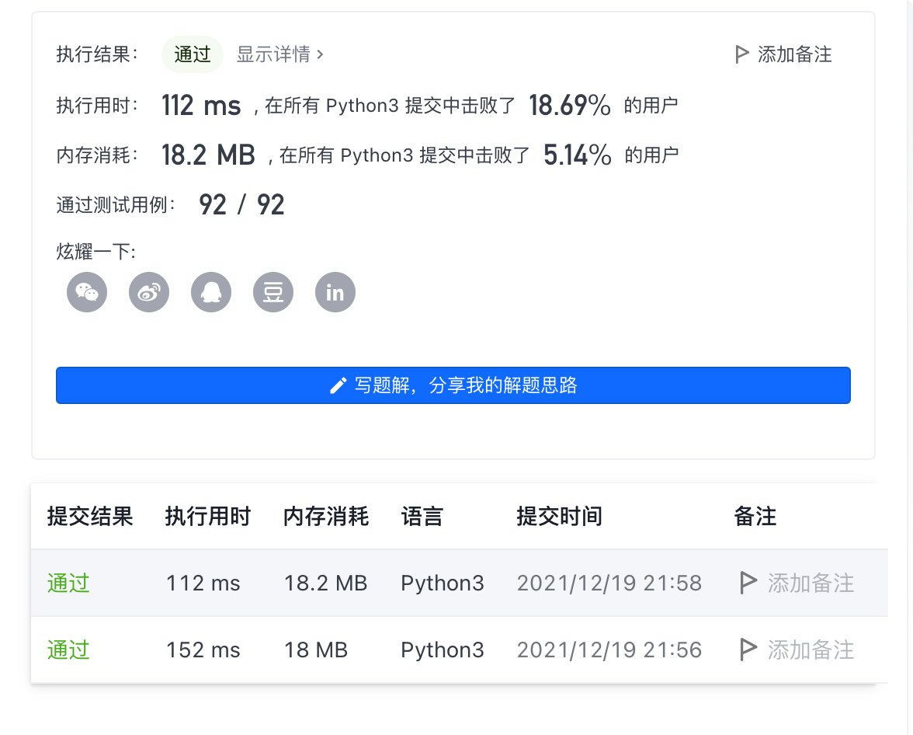

<!--
 * @Author: your name
 * @Date: 2021-12-19 21:57:25
 * @LastEditTime: 2021-12-19 22:12:21
 * @LastEditors: Please set LastEditors
 * @Description: 打开koroFileHeader查看配置 进行设置: https://github.com/OBKoro1/koro1FileHeader/wiki/%E9%85%8D%E7%BD%AE
 * @FilePath: /myweekend/leetcode刷题笔记/findJudge.md
-->
# 找到小镇的法官

## 提交记录

## 思路

### 题目
&emsp;&emsp;在一个小镇里，按从 1 到 n 为 n 个人进行编号。传言称，这些人中有一个是小镇上的秘密法官。\
&emsp;&emsp;如果小镇的法官真的存在，那么：\
&emsp;&emsp;小镇的法官不相信任何人。\
&emsp;&emsp;每个人（除了小镇法官外）都信任小镇的法官。\
&emsp;&emsp;只有一个人同时满足条件 1 和条件 2 。
&emsp;&emsp;给定数组 trust，该数组由信任对 trust[i] = [a, b] 组成，表示编号为 a 的人信任编号为 b 的人。\
&emsp;&emsp;如果小镇存在秘密法官并且可以确定他的身份，请返回该法官的编号。否则，返回 -1。

### 分析
要求满足三个条件，使用三维数组存储每一个人相信的人的数组和被谁相信的数组。\
> [ [相信s:[1,2,3],被谁相信[2,3,4]],[],[]...]

遍历数组，如果整个数组有且只有一个满足 ， 相信的人数组为空，被相信的数组长度为 n-1,没有处理重复数据的情况。那么这个是法官。

+ 这个方法效率低下。
## 解释
就是统计有向图出度和入度的数量。

# 优化
## 优化方案一
+ 我们做判断需要的仅仅是出度和入度，这是两个统计数量值，可以针对数组进行优化，不必存储，只需要维护两个数字即可。
  